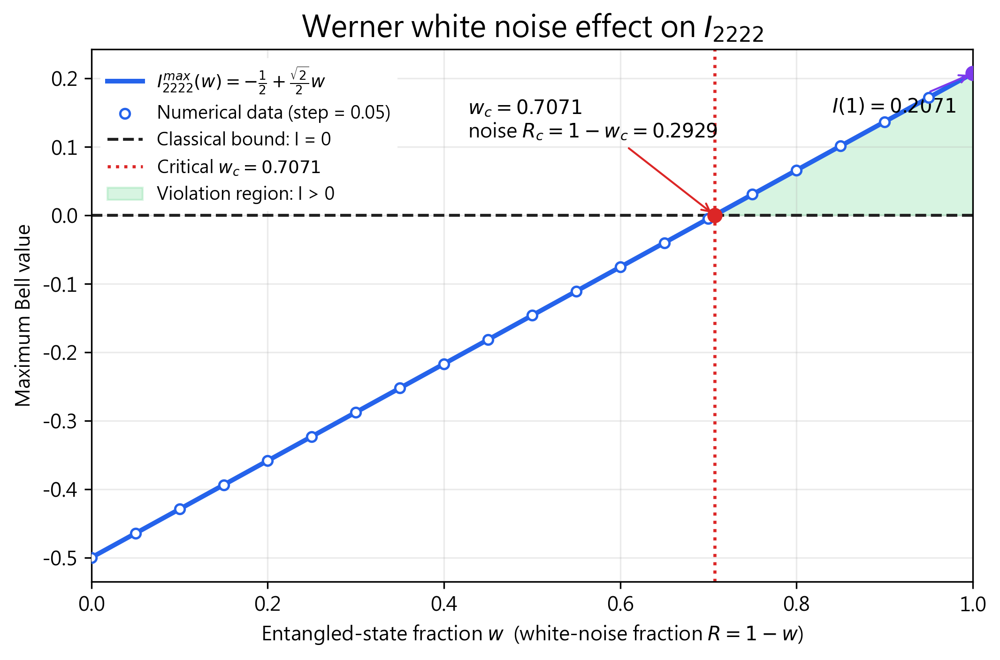
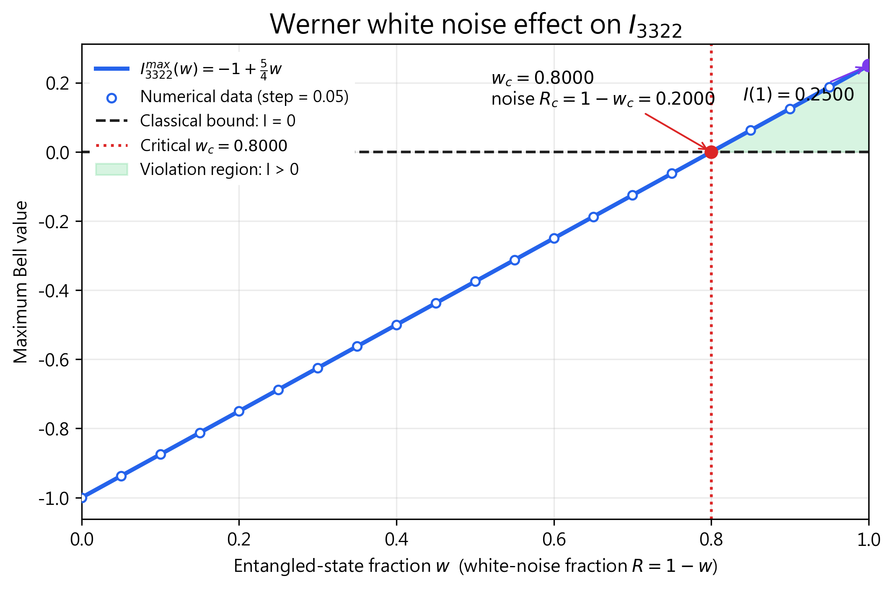
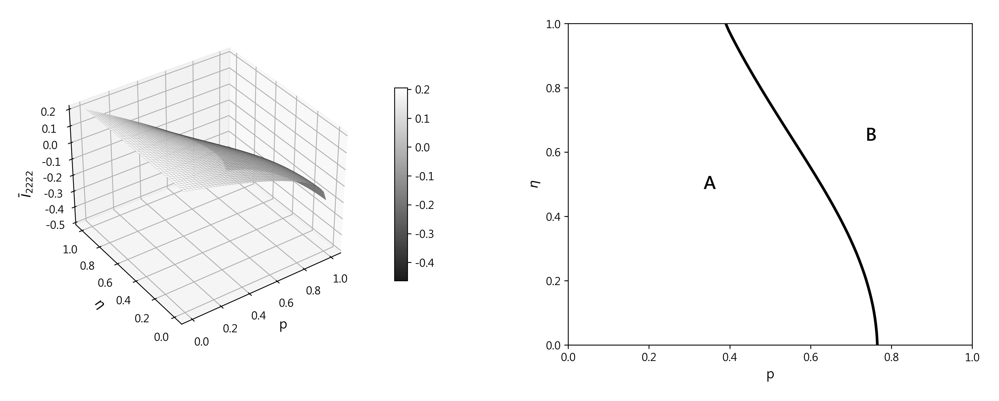
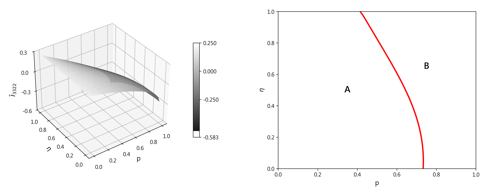

# 量子 Bell 型不等式研究 (A Study of Bell-Type Inequalities)

> **東海大學應用數學系 學士班整合式專題研究成果**  
> 本研究系統性推導 $I_{2222}$ (CHSH) 與 $I_{3322}$ (Collins-Gisin) 不等式之古典與量子上界，並透過 Python 數值模擬驗證在不同糾纏程度、Werner 白噪音模型及 Two-Kraus 噪聲通道下的量子非定域性違背與抗噪穩健性。

[](./專題競賽-Bell型不等式研究.pdf)
[](./codes/)
[](./Bell_inequality_study.tex)
[](https://math.thu.edu.tw/)

---

## 📌 研究基本資訊
- **作者**：李士宏 (LI Shihhong)
- **指導教授**：陳宏益 教授 (Prof. Horng-Yi Chen)
- **所屬單位**：東海大學 應用數學系 (Department of Applied Mathematics, Tunghai University)
- **完成日期**：2026 年 8 月
- **論文全文**：📄 [點此檢視／下載完整專題報告 (PDF)](./專題競賽-Bell型不等式研究.pdf)

---

## 🔬 研究動機與核心理論

Bell 不等式是檢驗局域隱變量模型與量子力學非定域關聯的核心工具。
- **$I_{2222}$ 不等式**：Alice 與 Bob 各具備 2 組二元投影測量設定（最基礎的 CHSH 形式）。
- **$I_{3322}$ 不等式**：兩端各擴充至 3 組測量設定，提供更廣泛的關聯結構與聯合機率資訊。

本研究補充了原始文獻省略的完整數學推導（利用投影算符、Bloch 球面向量幾何化與柯西-施瓦茨不等式），並提出關鍵假說進行檢驗：**「測量設定數量增加，是否必然帶來更高的噪聲抵抗能力？」**

---

## 💡 核心研究發現與成果

### 1. 純態理論極限與數值驗證
- **理論最大違背值**：
  - $I_{2222}^{\max} = \frac{\sqrt{2}}{2} - \frac{1}{2} \approx 0.2071$
  - $I_{3322}^{\max} = -1 + \frac{5}{4} = 0.2500$
- 利用自撰 Python 模擬 Monte Carlo 取樣與隨機統計漲落，驗證了數值解完全吻合推導曲線，兩者皆在最大糾纏態 $\alpha = \sqrt{2}/2$ 達到峰值。

### 2. 測量設定的自由度與補償機制（互換基底實驗）
- 將 $I_{2222}$ 最佳基底設定套用至 $I_{3322}$ 時，$I_{3322}$ 能藉由額外的 $(A_3, B_3)$ 測量方向進行**重新最佳化補償**，在偏離設定下依然保有違背能力。
- 反之，將 $I_{3322}$ 前四組基底強加於 $I_{2222}$ 時，$I_{2222}$ 無額外自由度可調整，違背能力遭到嚴重抑制。

### 3. 噪聲通道下的穩健性反轉（關鍵結論）
- **Werner 白噪音模型 (Werner White-Noise Model)**：
  - $I_{2222}$ 臨界態比例 $w_c = \frac{1}{\sqrt{2}} \approx 0.7071$ $\rightarrow$ **抗噪容忍度 $R_{2222} = 29.29\%$**
  - $I_{3322}$ 臨界態比例 $w_c = 0.8000$ $\rightarrow$ **抗噪容忍度 $R_{3322} = 20.00\%$**
  - **結論**：即便 $I_{3322}$ 擁有較高的純態違背值，在白噪音環境下 $I_{2222}$ 反而具備更佳的魯棒性（Robustness）。
- **Two-Kraus-Operator 噪聲通道**：
  - 繪製 $(p, \eta)$ 參數空間相位圖，證實兩不等式邊界曲線交叉互有勝負：在特定噪聲強度與通道型態下，存在「$I_{3322}$ 能辨識非定域性但 $I_{2222}$ 無法辨識」的區間，反之亦然。證明較多測量設定**不等於**全面性抗噪優勢。

---

## 📊 代表性研究圖表

<div align="center">
  
  
  <p><em>圖 1：$I_{2222}$ 與 $I_{3322}$ 在 Werner 白噪音模型下之最大量子違背與臨界抗噪容忍度 ($R_c$) 比較</em></p>
</div>

<div align="center">
  
  
  <p><em>圖 2：Two-Kraus 噪聲通道下之 $(p, \eta)$ 相位臨界圖（展示兩不等式臨界邊界之非重合與互補特性）</em></p>
</div>


---

## 📂 專案架構與程式碼對照

本專案內之數值模擬演算法均由作者自主開發重現：

```text
├── Bell_inequality_study.tex           # 專題論文 LaTeX 原始碼全文
├── references.bib                     # 參考文獻 (Bell, CHSH, Collins-Gisin, Nielsen & Chuang 等)
├── SCAM-ctemplate.sty / spiebib.bst   # 排版格式與引用樣式檔
├── 專題競賽-Bell型不等式研究.pdf       # 編譯完成之最終送審論文
│
├── Datapicture/                       # 數值模擬輸出之高清曲線圖與相圖
│
└── codes/                             # Python 數值模擬程式
    ├── 12222simulation.py             # 附錄一：I2222 不同糾纏參數與統計取樣模擬
    ├── 13322simulation.py             # 附錄二：I3322 不同糾纏參數與統計取樣模擬
    ├── 12222to13322.py                # 附錄三：將 I2222 最佳測量基帶入 I3322 重新最佳化
    ├── 13322to12222.py                # 附錄四：將 I3322 最佳測量基帶入 I2222 之限制模擬
    └── whitenoise.py                  # 附錄五：Werner 白噪音臨界值與衰減模擬
